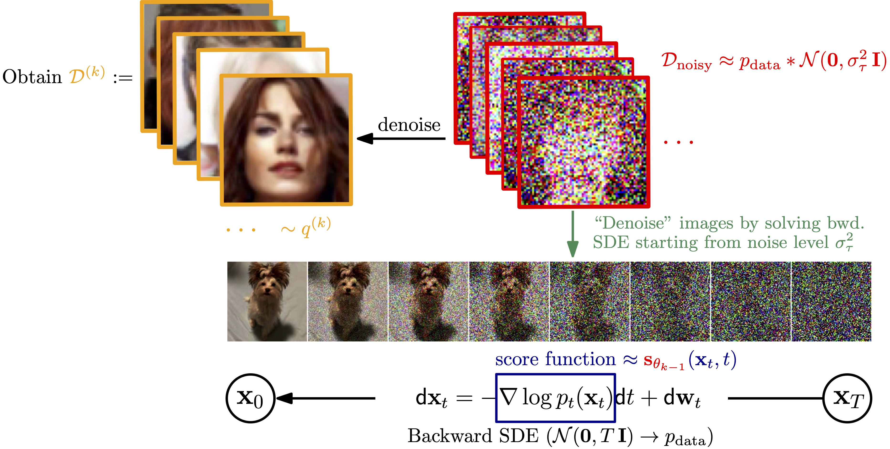

## Stochastic Forward-Backward Deconvolution: Training Diffusion Models with Finite Noisy Datasets<br><sub>ICML 2025</sub>



**Stochastic Forward-Backward Deconvolution: Training Diffusion Models with Finite Noisy Datasets**<br>
Haoye Lu, Qifan Wu, Yaoliang Yu
<br>https://arxiv.org/abs/2502.05446<br>

Abstract: *Recent diffusion-based generative models achieve remarkable results by training on massive datasets, yet this practice raises concerns about memorization and copyright infringement. A proposed remedy is to train exclusively on noisy data with potential copyright issues, ensuring the model never observes original content. However, through the lens of deconvolution theory, we show that although it is theoretically feasible to learn the data distribution from noisy samples, the practical challenge of collecting sufficient samples makes successful learning nearly unattainable. To overcome this limitation, we propose to pretrain the model with a small fraction of clean data to guide the deconvolution process. Combined with our Stochastic Forward--Backward Deconvolution (SFBD) method, we attain FID 6.31 on CIFAR-10 with just 4% clean images (and 3.58 with 10%). We also provide theoretical guarantees that SFBD learns the true data distribution. These results underscore the value of limited clean pretraining, or pretraining on similar datasets. Empirical studies further validate and enrich our findings.*

## Requirements
Our implementation builds on the [EDM](https://github.com/NVlabs/edm) framework. Please consult the repository’s Requirements section for environment setup details.


## Getting started

For pretaining and denoiser update step, run

```bash
bash scripts/train.sh
```

For Denoise step, run


```bash
bash scripts/denoise_submit.sh
```

**Notes**  
 - Before running either script, open the file and replace the placeholder paths with the correct locations for your data and environment.paths with the correct locations for your data and environment.  
 - The current hyperparameter selection in the scripts is for CelebA experiments.
 - After the denoising phase, merge the newly denoised samples with the original copyright-free (clean) dataset into a single directory to serve as the training set for the next denoiser-update round.


## Code attribution
The given implementation(s) is based on the [EDM](https://github.com/NVlabs/edm) repository.

## Citation

```
@inproceedings{lu2025sfbd,
  title        = {Stochastic Forward-Backward Deconvolution: Training Diffusion Models with Finite Noisy Datasets},
  author       = {Haoye Lu and Qifan Wu and Yaoliang Yu},
  booktitle    = {Proceedings of the 42nd International Conference on Machine Learning (ICML 2025)},
  year         = {2025},
  url          = {https://openreview.net/forum?id=WrWqv3mpQx}
}
```

